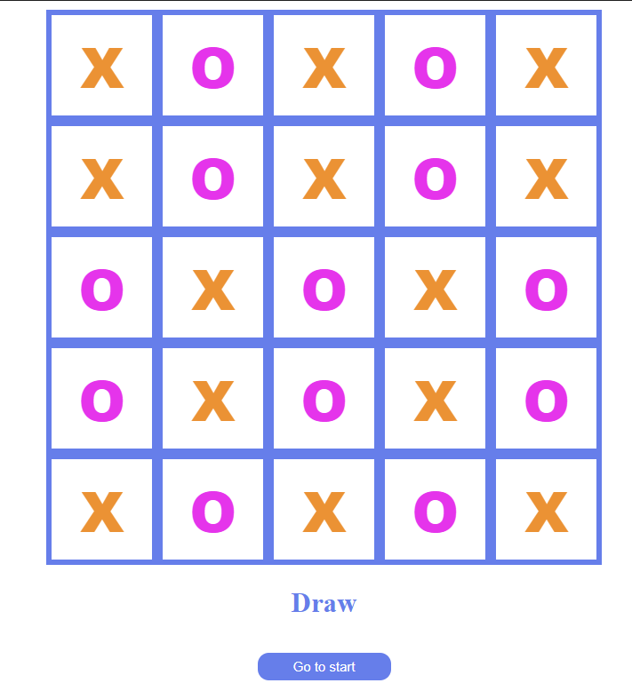
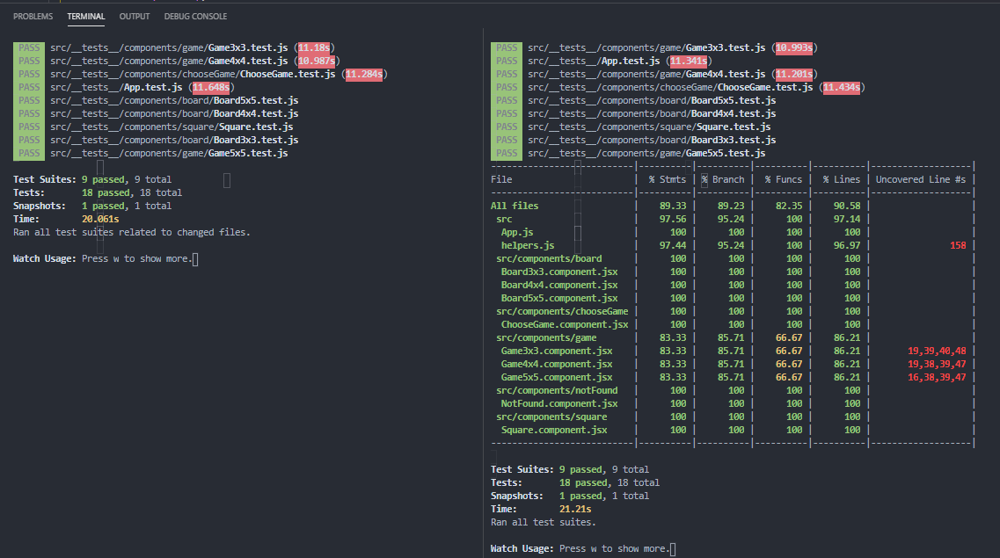
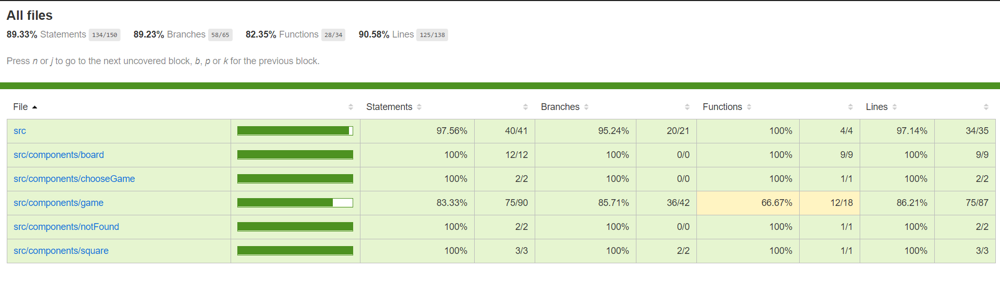

# Dynamic tic-tac-toe app ( 3x3 / 4x4 / 5x5 )

&nbsp;

    

&nbsp;
&nbsp;

&nbsp;
#### Requirements:

1. The game has to announce the winner - "X" or "O" - or a draw. Test cases (unit tests) must be written for this game logic. (3 points)
2. It must be possible to dynamically select the size of the game grid (3x3, 4x4, 5x5). Test cases (unit tests) must be written for this game logic. (3 points)
3. The winner is announced if 3 "X" or 3 "O" in a row are collected, regardless of the size of the board. Test cases are written for game logic (unit tests). (2 points)

&nbsp;
&nbsp;

# How to run the game locally

To run it locally on the computer download the project files in this repository. Once downloaded, open the terminal and run `npm install` to install all the dependencies needed for the project. Now to run the app - run `npm run start` or just `npm start` and the app should run automatically on localhost. 

&nbsp;
&nbsp;

# How to run tests

To run the tests, download the project and install dependencies with `npm install`. Now to run the tests we can run `npm run test` or `npm run test:coverage` to run our testing coverage.

    

&nbsp;
&nbsp;

Running testing coverage will also create a new coverage folder in the project. If you open the `index.html` file in the browser located at `coverage/lcov-report` folder you will be able to view the report:

    

&nbsp;
&nbsp;
